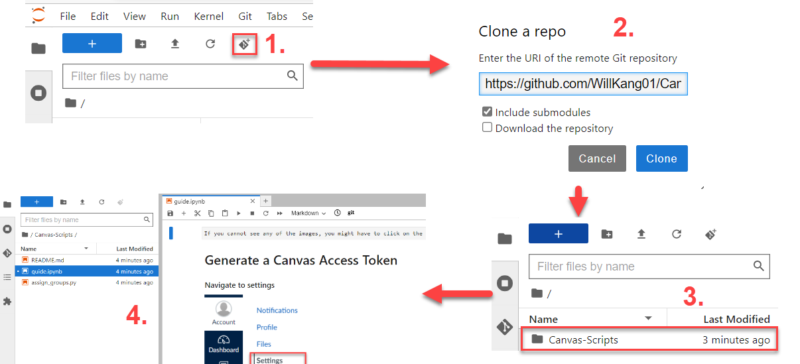

# Canvas-Scripts

## Setup

### Login to UBC Jupyter with your cwl here: https://ubc.syzygy.ca/

### Find the git clone button (images attached below) and enter this url: https://github.com/WillKang01/Canvas-Scripts.git

### Then follow the rest of the steps in guide.ipynb

